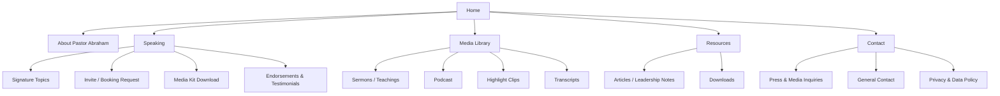
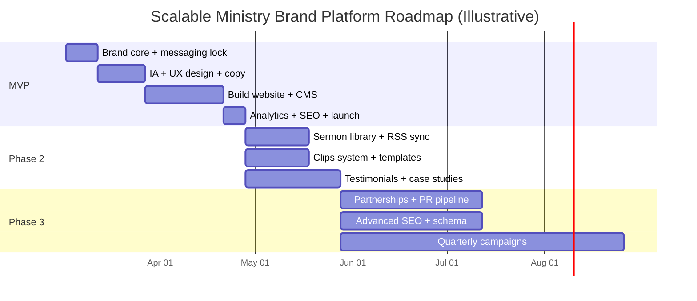

# PRD for a Scalable National Ministry Brand Platform for Pastor Abraham Tshabuse

## Executive summary

This Product Requirements Document defines the strategy, content system, website experience, technical foundation, measurement plan, and rollout roadmap for building “the beginning of a scalable national ministry brand” for Pastor Abraham Tshabuse, Lead Pastor of ActiveFaith Church. The platform is intended to increase *national speaking invitations* and *trusted ministry influence* by presenting a clear signature message, packaging speaking topics professionally, distributing high-quality media consistently, and making it frictionless for event organizers to invite, evaluate, and book Pastor Abraham.

The existing ActiveFaith Church digital presence already contains strong differentiators that can anchor a national-facing speaker brand: Pastor Abraham’s background as a qualified geoscientist with mineral exploration experience, a Master of Management from the University of the Witwatersrand, senior church leadership since 1998, and the founding of ActiveFaith Church with First Lady Nozizwe Tshabuse in 2016. citeturn1view0turn1view1 ActiveFaith’s stated vision and discipleship language—helping people reach God-given potential by depending on Jesus daily, and the “Rise, Relate, Reach” discipleship lifecycle—offer immediate, repeatable brand motifs that translate well into conference themes and leadership settings. citeturn1view0

However, there is a clear platform gap: the church website’s “Sermons” and “Podcast” sections currently show no available items, even while a robust sermon podcast exists externally (with recent episodes continuing into February 2026). citeturn15view0turn15view1turn16view1 This PRD treats distribution and packaging (not just content creation) as the core product problem: the work is to convert existing ministry output into an “invite-ready” speaker funnel with credible assets (media kit, topics, booking process, testimonials, highlight reels), supported by modern SEO, analytics, accessibility, performance, and privacy compliance.

Deliverable outcome: a speaker-brand website and media kit system that (1) clarifies Pastor Abraham’s “signature voice,” (2) showcases proof via curated sermons/clips, (3) captures and nurtures organizer leads ethically, and (4) operationalizes invitations into a trackable pipeline (inquiry → qualification → booking → assets delivery → follow-up).

PRD complete.

## Context and brand core

### Brand foundation drawn from verified ministry facts

Pastor Abraham Tshabuse is presented on the ActiveFaith Church website as: born in Soweto, Gauteng; holder of a Master of Management (University of the Witwatersrand); qualified geoscientist with mineral exploration experience; in senior church leadership since 1998; and co-founder (with his wife Nozi) of ActiveFaith Church in 2016, serving as senior pastor. citeturn1view0

ActiveFaith Church’s public framing provides additional “brand-shaping” primitives that should be reused consistently across the new speaker platform:

- Vision: “To see all people reach their God-given potential, by depending on Jesus everyday.” citeturn1view0  
- Mission: “Doing everything possible to inspire, equip and support people; grow and experience the joy of Faith in CHRIST.” citeturn1view0  
- Discipleship lifecycle: Rise (Salvation, potential to do life effectively), Relate (Fellowship), Reach (Ministry, purpose to do life no matter what). citeturn1view0  
- Governance and credibility cues: the church states it is a registered non-profit company with “strict financial management controls,” accountable to an advisory board of elders consisting of professionals and leaders. citeturn1view1  
- Values mnemonic: “A Church That BELIEVES,” articulated as Boldness, Emancipation, Loyalty, Integration, Excellence, Verity, Endowment, Simplicity. citeturn1view0  

These points matter in a national platform because event organizers evaluate not only speaking ability but also governance maturity, professionalism, and reputational risk. The advisory board/controls language should be translated into a professional credibility section in the media kit and speaking page. citeturn1view1

### Brand core deliverables required in MVP

The platform must ship with a cohesive brand core that is repeatable across web, one-sheets, social profiles, and booking emails.

**Positioning statement (proposed)**  
Pastor Abraham Tshabuse is a faith-and-leadership voice who equips believers and leaders to depend on Jesus daily and reach their God-given potential—through Scripture-centered teaching, disciplined discipleship, and governance-minded ministry-building. (Grounded in ActiveFaith vision/mission + pastor bio and governance emphasis.) citeturn1view0turn1view1

**Three-word identity (proposed options)**  
Because this is the *beginning* of a scalable brand, the system should test and converge on one three-word identity over 90–120 days using engagement and invite conversion feedback.

| Option | Why it fits the existing evidence base |
|---|---|
| Active. Grounded. Strategic. | Matches “active faith” framing and adds leadership/system strength consistent with governance and management background. citeturn1view0turn1view1 |
| Jesus-Centered. Practical. Excellent. | Reflects stated mission, and aligns with excellence/value emphasis. citeturn1view0 |
| Faith. Leadership. Potential. | Mirrors the vision language (“potential”) and positions beyond the local church context. citeturn1view0 |

**Signature voice (product definition)**  
The signature voice is the repeatable lens audiences should recognize after 3–5 exposures. For Pastor Abraham, the signature voice should be packaged as:

- Faith as an *active, daily dependency* on Jesus (not abstract or passive), expressed with practical application and clear decisions.
- Leadership and church-building with governance discipline (accountability structures, excellence standards, sustainable ministry practices). citeturn1view1turn1view0  
- A “potential” theology of growth: moving individuals from salvation (Rise) to fellowship (Relate) to purpose-driven ministry (Reach). citeturn1view0  

### Sample hero headline options

These are designed to immediately communicate “national platform” posture: a distinct message + an organizer pathway.

1) “Activate Faith. Build a Life That Matters.”  
2) “Depend on Jesus Daily—Lead With Courage.”  
3) “Faith That Works. Leadership That Lasts.”  
4) “From Potential to Purpose—A Practical Faith Journey.” (Mapped to Rise–Relate–Reach.) citeturn1view0  
5) “Scripture-Centered Teaching for Real-World Leadership.”  
6) “A Governance-Minded Voice for Sustainable Churches.” (Anchored in advisory-board/governance emphasis.) citeturn1view1  
7) “Where Faith Becomes Action—and Action Becomes Impact.”  
8) “Reach Your God-Given Potential by Depending on Jesus.” (Directly derived from the church’s vision.) citeturn1view0  

### Short bio drafts

The bios below intentionally use only details substantiated by official ActiveFaith statements and observable distribution channels.

**Bio (50 words)**  
Pastor Abraham Tshabuse is the Lead Pastor of ActiveFaith Church, founded with his wife Nozizwe in 2016. A qualified geoscientist with mineral exploration experience and a Master of Management (University of the Witwatersrand), he has served in senior church leadership since 1998 and teaches faith as active, daily dependence on Jesus. citeturn1view0turn1view1

**Bio (150 words)**  
Pastor Abraham Tshabuse is the Lead Pastor of ActiveFaith Church in Ferndale, Randburg, which he founded with his wife, First Lady Nozizwe Tshabuse, in 2016. He was born in Soweto, Gauteng, holds a Master of Management from the University of the Witwatersrand, and is a qualified geoscientist with experience in mineral exploration. He has served in senior church leadership since 1998. His ministry focus centers on helping people reach their God-given potential by depending on Jesus daily, communicated through Scripture-centered teaching and a clear discipleship framework that moves people from salvation to fellowship to purpose-driven ministry. ActiveFaith operates with governance structures, including an advisory board of elders and stated financial controls, reflecting a commitment to excellence and accountability. citeturn1view0turn1view1

**Bio (300 words)**  
Pastor Abraham Tshabuse is the Lead Pastor of ActiveFaith Church (Ferndale, Randburg), founded in 2016 alongside his wife, First Lady Nozizwe Tshabuse. Born in Soweto, Gauteng, Pastor Abraham brings a rare blend of academic, marketplace, and ministry leadership experience: he holds a Master of Management from the University of the Witwatersrand and is a qualified geoscientist with solid experience in mineral exploration. He has served in senior church leadership since 1998.  

Pastor Abraham’s public ministry message is anchored in a simple, repeatable vision: to see all people reach their God-given potential by depending on Jesus every day. He teaches faith as active—practical, resilient, and measurable in everyday decisions—while remaining explicitly Christ-centered. His discipleship language is structured around a three-part lifecycle: Rise (salvation and the potential to do life effectively), Relate (fellowship and partnership for a meaningful life), and Reach (ministry and purpose to do life no matter what).  

ActiveFaith also emphasizes governance maturity and operational stewardship: the church states it is accountable to an advisory board of elders consisting of professionals and leaders, and that it adheres to strict financial management controls as a registered non-profit company. This combination—spiritual conviction, leadership structure, and disciplined execution—positions Pastor Abraham as a compelling voice for churches, conferences, and leadership gatherings seeking biblically grounded teaching with clear application and sustainable impact. citeturn1view0turn1view1

## Target audiences and channels

A scalable national ministry brand must prioritize the audiences who *control invitations* and the audiences who *amplify influence*. The platform should be designed as a dual-sided product:

- Organizer side: evaluate credibility quickly, reduce booking friction, access assets.  
- Attendee side: consume content, subscribe, share, build demand pull.

### Audience segmentation model

| Segment | Who they are | Primary motivation | Trust triggers | Primary channels |
|---|---|---|---|---|
| Conference and event organizers | Directors/planners of church conferences, leadership summits, men’s/women’s gatherings, youth conferences, marketplace faith events | Reduce risk; book a speaker who fits the theme and delivers reliably | A clear topic list, strong highlight reel, testimonials, professional media kit, disciplined booking process | Google search, referrals, email outreach, social proof pages, YouTube clips, podcast samples |
| Pastors and church leadership teams | Leaders seeking guest speakers, “leaders-teaching-leaders,” and structural discipleship ideas | Practical teaching + transferable frameworks for their congregations | Governance maturity, clarity of doctrine and discipleship, predictable excellence | Peer networks, WhatsApp referrals, YouTube, podcast platforms |
| Christian professionals and leaders | Marketplace believers seeking faith-driven leadership content | Faith integrated with real decisions and leadership | Professional background credibility + clear application | LinkedIn, YouTube, podcasts; recommended content loops |
| ActiveFaith extended ecosystem | Members, partners, and regional relationships who can seed national spread | Proud advocacy; shareable content | Familiarity, trust, consistent messaging | Social channels and direct sharing |
| Media and platforms | Christian media outlets, podcasts, interviewers | Interview-ready voice; clean story; easy logistics | Press contact, bio variants, topic angles, media-friendly assets | Email pitching, press kit, social proof |

### What “scaled to national invitations” requires operationally

National invitations are driven by a repeatable loop:

1) Discovery: organizers encounter content or a referral  
2) Validation: organizers watch 3–7 minutes and decide “this fits”  
3) Booking: organizers submit an invite form with clear constraints  
4) Fulfillment: organizers receive a standard speaker package (bio, photos, AV rider, intro)  
5) Amplification: clips and testimonials generated from the event propagate the loop

The PRD treats steps 2–4 as the primary UX focus because that is where most speaker brands fail: they have content, but do not have a low-friction *organizer decision path*.

## Signature speaking topics and productized offers

The website must present Pastor Abraham’s speaking not as “general preaching availability,” but as a productized menu of outcomes. Topics should be framed for specific event types, with clear takeaways, and match themes already present in his publicly distributed sermons (e.g., “The Power of Now,” “The Courage to Change,” “Faithfulness to Flourish,” and others published as podcast episodes through February 2026). citeturn16view1

### Speaking topics MVP set

These topics are designed to work across church contexts while expanding into leadership and governance spaces.

| Signature topic | Synopsis | Best-fit target event types |
|---|---|---|
| Active Faith in Real Life | Faith is not passive; it is daily dependence on Jesus expressed through action, resilience, and obedience. Designed to move audiences from inspiration to tangible steps. | Sunday services, revival nights, church anniversaries, evangelism-focused gatherings |
| From Potential to Purpose | A growth pathway for believers: aligning identity in Christ with disciplined habits and purpose-driven decisions. Strong fit with ActiveFaith’s “God-given potential” vision language. citeturn1view0 | Leadership weekends, young adult conferences, mentorship programs, discipleship intensives |
| Rise, Relate, Reach | A transferable discipleship framework: salvation foundations (Rise), community and partnership (Relate), and ministry purpose (Reach). This is positioned as a system churches can adapt, not a one-off sermon. citeturn1view0 | Pastor/leader trainings, church growth summits, discipleship workshops, small-group leader conferences |
| Governance, Excellence, and Sustainable Church Building | Practical counsel for building ministry that lasts: accountability, governance structure, stewardship, excellence culture, and sustainable volunteer mobilization—modeled on ActiveFaith’s emphasis on advisory governance and financial controls. citeturn1view1 | Leadership conferences, elders/deacons trainings, church boards, ministry operations retreats |
| The Courage to Change | A transformation message aimed at turning points: honesty, repentance, renewed thinking, and decisive action. This aligns with the themes and titles shown in the podcast feed (e.g., “The Courage to Change”). citeturn16view1 | Men’s/women’s conferences, altar-call nights, recovery/renewal events, New Year/vision services |

### Requirements for each topic page

Each topic must have a “topic page template” with:

- A 1–2 sentence promise (what changes for the audience)
- A short synopsis (80–120 words)
- 3 bullet takeaways (kept minimal—organizers scan)
- 2 supporting sermon clips (2–5 minutes each)  
- Suggested audience types (leaders, youth, mixed congregation)
- Suggested session formats (keynote, breakout, workshop, panel)
- A “Request this topic” CTA that pre-fills the invite form topic field

Competitor patterns support exposing invitation forms prominently and capturing event details such as audience size, dates, expectations, and theme needs. citeturn12view2

## Content and media requirements

The platform must be built on a media system that supports long-form credibility, mid-form depth, and short-form reach. Because production capability already exists (assumption), the PRD focuses on specs, workflows, and metadata so assets can scale without chaos.

### Media inventory and distribution realities

- The church website currently does not surface sermons/podcast episodes in its own library pages. citeturn15view0turn15view1  
- A populated podcast distribution exists externally with frequent releases through February 2026 (e.g., episodes listed on February 16 and February 9, 2026). citeturn16view1  
- The official YouTube presence is described publicly as featuring “Christ centred biblical teachings from Pastor Abraham Tshabuse.” citeturn0search2  

The product requirement is to unify these into one “canonical library” where the website becomes the stable hub, while external platforms remain distribution channels.

### Content deliverables and specifications

| Asset type | MVP requirement | Specs and formats | Metadata and tagging requirements |
|---|---|---|---|
| Hero video | Optional but recommended | 20–40 seconds, muted autoplay (where permitted), captions burned-in or provided; deliver in MP4 with web-optimized encoding guidelines aligned to YouTube’s recommended container (MP4) where relevant. citeturn7search0 | Title, date, location, rights owner, caption file reference |
| Highlight reels | Required | 60–90 seconds (primary), 15–30 seconds (ads/social), plus 2–5 minute “organizer proof” clips | Topic, scripture reference, key quote, CTA link destination |
| Full teaching videos | Required | Hosted on YouTube or Vimeo; ensure consistent encoding practices; YouTube provides recommended upload encoding guidance. citeturn7search0 | Series name, sermon title, recording date, scripture, transcript, language |
| Podcast audio | Required | Maintain an RSS feed compliant with Apple Podcasts requirements; Apple provides podcast RSS and audio requirements and accepted formats (e.g., WAV, FLAC, MP3) for certain workflows. citeturn7search1turn7search17 | Episode title, episode number, season/series label, description, keywords, explicit flag, cover art |
| Photography set | Required | 3 categories: stage preaching, portraits (studio/controlled), lifestyle/leadership | Credits, usage rights, consistent naming, alt text references |
| Written resources | Phase 2+ | Devotionals, articles, leadership notes, downloadable PDFs | Author, canonical URL, publication date, tags, schema markup fields |

### File naming and media metadata conventions

A scalable platform needs deterministic naming conventions that work across cloud storage, editing handoffs, and web ingestion.

**Recommended file naming convention**  
Use a strict, sortable pattern:

`PASTORABRAHAM_<AssetType>_<YYYY-MM-DD>_<SeriesOrTopic>_<EventOrVenue>_<City>_<Language>_<Version>.<ext>`

Examples (illustrative):

- `PASTORABRAHAM_VIDEO_2026-02-02_ThePowerOfNow_ActiveFaith_Randburg_en-ZA_MASTER.mp4`
- `PASTORABRAHAM_CLIP_2026-02-02_ThePowerOfNow_KeyQuote01_Randburg_en-ZA_60s.mp4`
- `PASTORABRAHAM_AUDIO_2026-02-16_HowToGrowInGodsFavour_Podcast_en-ZA_EPISODE.mp3` citeturn16view1  
- `PASTORABRAHAM_PHOTO_2026-01-15_PortraitSet_Studio_JHB_en-ZA_Selects_001.jpg`

**Required metadata fields (store in CMS + in asset manager notes)**  
Title, description, speaker, date recorded, location, scripture reference(s), topic tag(s), series tag, audience type, language, rights/usage status, editor, transcript link, thumbnail reference.

**Social preview metadata requirement**  
All shareable pages must include Open Graph tags (e.g., `og:title`, `og:description`, `og:image`) per the Open Graph protocol specification. citeturn7search2

### Hosting and canonicalization requirements

- Video: prioritize YouTube for reach; optionally Vimeo for cleaner embeds. Ensure the website uses canonical pages with embedded players and tracks plays.
- Podcast: ensure RSS feed meets Apple podcast requirements and audio guidelines to remain widely syndicated. citeturn7search1turn7search17  
- Canonical hub principle: each sermon/episode has one canonical page with URL permanence, transcript, and clips—supporting SEO and organizer validation.

## Website requirements and user experience

The website is the product surface that converts “interest” into “invitations,” supported by content credibility and operational clarity.

### Information architecture

The IA must center the voice (Pastor Abraham) while still referencing ActiveFaith as the ministry home base. The IA should separate “Organizer paths” from “Audience paths” and keep primary CTAs persistent.

### Core pages and functional requirements

**Home (national platform posture)**  
Must communicate in 5 seconds: who he is, what he speaks on, and how to invite him. Include: hero statement, proof clip, featured topics, “Invite” CTA, and latest content modules.

**About page**  
Must include credibility anchors: born in Soweto; Master of Management (Wits); geoscientist background; leadership since 1998; founded ActiveFaith in 2016 with wife Nozi. citeturn1view0 Include “governance posture” (advisory board / stewardship language) without turning into church policy language. citeturn1view1

**Speaking landing page**  
Must be a “decision page” for organizers. Requirements:
- 5 signature topics with quick synopses
- One 2–3 minute highlight reel
- Testimonials (Phase 2 if unavailable now)
- “Invite” CTA and booking process overview
- Expected response time and who replies (ops clarity)

**Invite / booking request flow**  
Borrow structure from proven competitor patterns: capture date options, event size, audience description, theme expectations, and organizer relationship to the event. citeturn12view2

Invite form must include:
- Organizer name, role, organization, website
- Email, phone/WhatsApp
- Event name, city, venue type
- Proposed dates (multiple)
- Session count (1–3)
- Audience size range
- Audience type (leaders/mixed/youth/men/women)
- Theme + what they want him to deliver
- Budget field (optional at MVP; sensitive)
- Technical/AV notes
- Consent checkboxes aligned to POPIA rules

**Media kit download flow**  
Two acceptable models:
- Ungated for maximum organizer convenience, with optional email capture.
- Soft-gated: require email to receive download link, with explicit consent for marketing separate from transactional “send me the kit.”

Given South Africa’s POPIA rules and guidance emphasizing consent and opt-out discipline for electronic direct marketing, the safe default is: transactional delivery allowed for the requested asset; marketing subscription must be explicit opt-in. citeturn10view0

**Sermon and teaching library**  
Because the existing church site currently cannot load sermons/podcast items internally, the new platform must implement a robust library with:
- Filtering by topic, scripture, series
- Short “organizer proof” clips surfaced above long-form
- Transcript availability (Phase 2 if not immediate)
- Podcast page fed by RSS, mapped to canonical web pages  
(External podcast proof exists via public episode listings.) citeturn15view0turn15view1turn16view1

### Email capture flows

Email capture should serve two purposes, each with a distinct consent model:

1) Audience discipleship email (“weekly encouragement / leadership notes”)
2) Organizer pipeline nurture (“speaker availability, booking process, new highlight reel drops”)

POPIA-aligned approach requires that direct marketing by unsolicited electronic communication to non-customers requires prior consent and that consent can be withdrawn; the regulator also describes maintaining a database of objections and stopping marketing after objection. citeturn10view0

**Recommended flows**

| Flow | Entry points | Offer | Consent model | Automated follow-up |
|---|---|---|---|---|
| Audience newsletter | Home footer, blog/article end, clip pages | “Get practical faith + leadership insights” | Explicit opt-in checkbox | Welcome email → 3-email onboarding series → weekly |
| Organizer kit delivery | Media kit download, invite page | “Receive media kit + booking checklist” | Transactional delivery + optional opt-in for future updates | Email with kit → 48h follow-up “any questions?” |
| Invite submission | Invite form | “We’ll confirm availability” | Required processing consent for replying | Auto confirmation → internal routing → human response SLA |

## Technical requirements, analytics, and compliance

### CMS and hosting requirements

Because the platform is media-heavy and needs fast iteration, the CMS must support:

- Structured content types: Topics, Sermons, Clips, Testimonials, Events, Downloads
- Editorial workflow: draft → review → publish
- SEO fields: title, description, canonical URL, social image
- Media asset references (not necessarily hosting inside CMS)

CMS candidates (decision to be finalized; budget/team unspecified):
- WordPress (custom post types + SEO plugins) for simplicity and editor familiarity
- Headless CMS (Sanity/Contentful) + modern frontend for performance and developer velocity

Hosting requirements:
- CDN-backed delivery, HTTPS, automated backups, staged deploys
- Separation of environments: dev/stage/prod
- Observability: uptime monitoring, error logging

### Accessibility requirements

Target compliance: WCAG 2.2 Level AA as baseline. WCAG 2.2 was published as a W3C Recommendation on October 5, 2023, and adds success criteria such as “Focus Not Obscured (Minimum)” and “Target Size (Minimum).” citeturn6search0

Minimum acceptance criteria:
- Keyboard navigability
- Visible focus states not obscured
- Sufficient color contrast
- Captions for video; transcripts for audio where feasible
- Form error messages and labels accessible

### Performance requirements

Core Web Vitals must meet “good” thresholds at the 75th percentile:
- LCP ≤ 2.5s
- INP ≤ 200ms
- CLS ≤ 0.1 citeturn20view0turn20view1

This is not only UX hygiene; Google explicitly recommends achieving good Core Web Vitals for success with Search and for user experience. citeturn20view1

### Security requirements

The platform will process personal data (contact forms, downloads), so baseline security must align with OWASP Top 10 awareness and controls (e.g., access control, secure configuration, dependency hygiene). citeturn6search3

Minimum technical controls:
- HTTPS everywhere
- Form spam protections (rate limiting, reCAPTCHA/hCaptcha)
- Secure admin access (MFA for CMS)
- Regular updates and dependency scanning
- Backups + restore drills

### SEO and structured data requirements

Google’s Search Essentials and technical SEO documentation should guide basic eligibility and indexing hygiene (crawlability, canonicalization, structured data where appropriate). citeturn6search5turn6search13

Structured data requirements:
- Implement `Person` schema for Pastor Abraham as an entity node. citeturn18search0  
- Implement `Organization` / ministry representation as appropriate, and `Event` schema for public events or appearances if surfaced. citeturn18search2turn18search10  
- Follow Google structured data intro and policies. citeturn18search3turn18search11

SEO target set (initial):
- Branded: “Pastor Abraham Tshabuse,” “ActiveFaith,” “ActiveFaith Church”
- Category: “faith leadership,” “church leadership speaker,” “discipleship framework,” “church governance”
- Geo: “South Africa,” “Johannesburg,” “Randburg” (as needed for credibility/backlinking)

### Analytics instrumentation

Implement GA4 + Tag Manager (or equivalent). Use a disciplined event taxonomy. Google provides recommended events for lead generation funnels and event naming rules (case sensitivity, allowed characters, no spaces, etc.). citeturn11search0turn11search1turn11search2

**Recommended analytics events**

| Event name | Trigger | Purpose |
|---|---|---|
| `generate_lead` | Invite form submitted | Core “speaker inquiry” conversion (pipeline entry) |
| `file_download` | Media kit PDF downloaded | Organizer intent signal |
| `sign_up` | Newsletter subscription | Audience growth |
| `view_item` | Topic page viewed | Topic interest tracking |
| `select_content` | Clip clicked/played | Content validation behavior |
| `contact` | Press contact form submitted | PR pipeline |

Event naming must follow GA4 naming rules (letters/numbers/underscores; case sensitivity; no spaces). citeturn11search1

### Privacy and marketing compliance

Because email capture and outreach are core to scaling invitations, the platform must align with POPIA direct marketing constraints and guidance. The Information Regulator’s Guidance Note outlines that unsolicited electronic direct marketing to a non-customer requires prior consent, and that responsibility includes providing accessible objection mechanisms, maintaining an objection database, and stopping processing after objection. citeturn10view0

Implementation requirements:
- Separate “transactional” vs “marketing” consent clearly
- Every marketing email includes unsubscribe
- Maintain suppression list (“do-not-contact”) and do not re-contact after objection, aligned with the guidance note’s direction on stopping after objection and maintaining an objections database. citeturn10view0
- Cookie consent management if analytics cookies are used (particularly if using advanced tracking)

## Go-to-market, competitor analysis, roadmap, KPIs, and risks

### Competitor analysis

Comparable ministry/speaker platforms demonstrate the common structural patterns required to scale invitations: prominent “invite” CTAs, a clear content engine (podcast/blog/video), and a strong email capture mechanism.

| Site | Messaging posture | “Invite” mechanism | Email capture | Content engine | Notable UX takeaway |
|---|---|---|---|---|---|
| Craig Groeschel | High authority; clearly positions speaking availability and leadership content | Prominent “Invite Craig” CTA visible on top pages; press routing guidance exists on the connect page (press email and interview details). citeturn12view0turn12view1 | Present (“Keep Up With Craig” section surfaced on homepage). citeturn12view0 | Blog + leadership podcast positioned as a tool; link to resources and guides. citeturn12view0turn12view1 | Make “Invite” a top nav / persistent CTA; separate press vs invite vs questions. citeturn12view1 |
| Christine Caine | Global ministry voice; explicitly speaker-centric | Detailed invite form captures audience size, dates, theme expectations, session count—highly aligned with organizer needs. citeturn12view2 | Invite flow includes subscription option. citeturn12view2 | Podcasts, books, events emphasized in nav. citeturn12view2 | Invite forms should qualify organizers (dates, audience, expectations) to reduce back-and-forth. citeturn12view2 |
| John Bevere | Clear identity as teacher/author/speaker; includes mission metrics | Event calendar is visible; speaker identity strongly stated in “About John.” citeturn14view0 | Aggressive value-led email capture (“A Gift For You”). citeturn14view0 | Podcasts + blog integrated; strong mission metrics (global reach numbers). citeturn14view0 | Use a lead magnet and mission impact metrics to build authority and belonging. citeturn14view0 |
| Joyce Meyer Ministries | Large institutional platform; donation/prayer infrastructure | Conference/event promotion prominent; donation UX robust | Data capture integrated into donation and prayer flows | High-volume devotional + media engine | Even without “speaking invite,” the site weaponizes clear CTAs and content modularity for scale. citeturn14view2 |

Implication for Pastor Abraham’s platform: it must combine (1) Groeschel-style authority framing + press clarity, (2) Caine-style organizer qualification, and (3) Bevere-style email capture and mission metrics—while remaining authentic to ActiveFaith’s existing vision and discipleship language. citeturn1view0turn12view1turn12view2turn14view0

### PR and outreach requirements

#### Press kit contents

Minimum press kit package (Phase MVP-to-2):
- Press page with PR contact route
- Bios (50/150/300 words)
- High-resolution photos (portrait + stage)
- Official logo lockups (if applicable)
- Topic list + short synopses
- “Stage introduction” script (30–45 seconds)
- Recent highlight reel link
- Social handles and verified channels statement  
Competitor precedent: Craig Groeschel’s site explicitly routes press interview requests to a dedicated press email and requests medium/deadline/topic clarity. citeturn12view1

#### Outreach sequence (national invitation pipeline)

This sequence assumes the platform exists as the credibility anchor:

1) Warm introduction (network referrals) → share “Invite” page + 60–90s reel  
2) Cold outreach to conference directors → single paragraph value + 3 topic options + proof clip  
3) Follow-up after 3–5 business days → offer alternative date or virtual keynote  
4) Post-event nurture → request testimonial + permission to clip highlights  
5) Quarterly reactivation → “new highlight reel / new topic / availability windows”

#### Sample email templates

**Template A: Conference director outreach (cold)**  
Subject: Speaker inquiry — faith + leadership message for your 2026 program  
Hi [Name],  
I’m reaching out to explore whether Pastor Abraham Tshabuse would be a fit for [Event/Conference]. His message centers on helping people reach their God-given potential by depending on Jesus daily, delivered with clear, practical application and leadership structure. citeturn1view0  
If helpful, here are three topics that align well with conferences: Active Faith in Real Life; From Potential to Purpose; and Rise–Relate–Reach (a discipleship framework churches can adopt). citeturn1view0  
Would you be open to a brief call to confirm theme fit and dates? I can also send a media kit and a short highlight reel.  
Thank you,  
[Name / Team]  

**Template B: Reply to an incoming invite form (ops response)**  
Subject: Re: Invitation request — next steps  
Hi [Name],  
Thank you for inviting Pastor Abraham Tshabuse to [Event]. We’ve received your request and will confirm availability for the dates listed.  
To finalize fit and planning, could you confirm:  
- expected audience type (leaders/mixed/youth),  
- session format (keynote/workshop), and  
- your program theme focus.  
We’ll reply with availability windows, travel/logistics notes, and a speaker asset pack (bio, photos, intro script, AV needs).  
Warm regards,  
[Ops contact]  

**Template C: Media kit delivery (transactional + optional marketing)**  
Subject: Your requested media kit — Pastor Abraham Tshabuse  
Hi [Name],  
Here is the media kit you requested (speaker bio, photos, topics, booking checklist).  
If you’d like occasional updates on new highlight clips and availability windows, you can opt in here: [checkbox/managed link].  
Regards,  
[Ops contact]

### KPIs and success metrics by phase

KPIs must map to the invitation pipeline, not vanity metrics alone.

| Phase | Primary objective | Core KPIs | Targets (placeholders; calibrate post-MVP) |
|---|---|---|---|
| MVP | Credible national speaker presence + functional invite funnel | Invite form submissions (`generate_lead`), media kit downloads, topic page engagement, email signups | Unspecified targets until baseline traffic is known |
| Phase 2 | Content engine + SEO flywheel | Organic search growth, clip play-through rate, email open/click, inquiry-to-booking conversion | Set targets after 60–90 days of data |
| Phase 3 | National authority + partnerships | Speaking bookings per quarter, repeat invitations, press/interview appearances, backlink growth | Set targets after the first booking cycle |

### Phased roadmap with timelines and resourcing

Timelines are estimates expressed in weeks from kickoff because the budget, team size, and vendor availability are unspecified.

**Resource estimate (role-based; hours are placeholders)**  
Because production capability exists, resourcing focuses on strategy, copy, design, development, and ops.

| Workstream | Roles | Estimate |
|---|---|---|
| Brand strategy + messaging | Brand strategist, pastor stakeholder, copywriter | 20–40 hours |
| UX + design | UX designer, visual designer | 40–80 hours |
| Development | Web developer(s), CMS engineer | 80–160 hours |
| Content packaging | Editor, motion graphics (for clips), copywriter | 40–120 hours |
| Analytics/SEO | SEO specialist, analytics implementer | 15–40 hours |
| Ops pipeline setup | Admin/ops lead | 10–25 hours |

### Risks and mitigation

| Risk | Why it matters | Mitigation |
|---|---|---|
| Message dilution (too many themes) | National scale requires a single repeated signature | Enforce the 5-topic menu; don’t publish new topics publicly without a quarterly review |
| Organizer friction | Invitations die if forms are unclear or follow-up is slow | Use qualification fields modeled on proven invite forms; implement response SLAs and routing automation. citeturn12view2 |
| Content exists but is not discoverable | Current church site shows “no sermons/podcasts available yet,” which weakens proof | Build canonical sermon/podcast library and embed external feeds. citeturn15view0turn15view1turn16view1 |
| Privacy non-compliance | Email capture + outreach without consent creates legal/reputation risk | Separate transactional vs marketing consent; maintain opt-out database; stop after objection as guidance describes. citeturn10view0 |
| Performance regressions due to heavy media | Video and imagery can break Core Web Vitals, hurting UX and SEO | Set performance budgets aligned to LCP/INP/CLS thresholds; use CDN, compression, lazy loading. citeturn20view1turn20view0 |
| Security exposure via forms/CMS | Forms and CMS are common attack points | Apply OWASP-aware controls, MFA, updates, spam protection, monitoring. citeturn6search3 |

### Recommended next steps

1) Approve the brand core: choose one positioning statement and one three-word identity option for MVP testing.  
2) Build the MVP speaking funnel: Home → Speaking → Topic → Invite → Confirmation → Ops follow-up.  
3) Produce the minimum media kit pack: highlight reel (60–90s), 3 proof clips (2–5m), photos, bios, intro script.  
4) Implement canonical content ingestion: podcast RSS mapping + sermon/clip taxonomy, so the website becomes the stable hub. citeturn7search1turn16view1  
5) Instrument analytics and privacy-first capture: GA4 events + consent handling consistent with POPIA guidance. citeturn11search0turn11search1turn10view0  

### Downloadable speaker one-sheet mockup outline

This is the structure the website must also support in “Media Kit” form.

**Speaker One-Sheet (outline)**  
- Header: Pastor Abraham Tshabuse (title + 1-line positioning)  
- Hero image: stage or portrait  
- Quick facts: location base, travel availability (national), languages, typical session types  
- Signature topics (5) with 1–2 sentence synopses  
- Audience outcomes (3–5 measurable takeaways)  
- Short bio (150 words)  
- Clip links: highlight reel + 2 proof clips  
- Booking: contact name, email, phone/WhatsApp, website invite form route  
- Logistics: AV requirements, recording permissions, travel expectations  
- Social proof: 2–3 testimonials (Phase 2 if not available)  
- Footer: social handles + copyright/usage note

PRD complete.